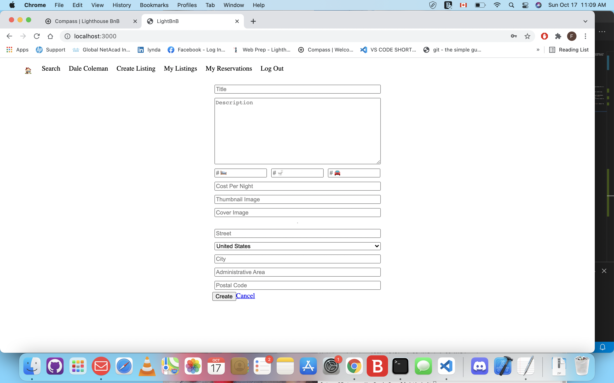

# LightBnB

LighthBnB is an app that will revolutionize the travel industry. It will allow homeowners to rent out their homes to people on vacation, creating an alternative to hotels and bed and breakfasts...There’s nothing else like it! Users can view property information, book reservations, view their reservations, and write reviews.


## Project Structure(LightBnb_WebApp)

```
├── public
│   ├── index.html
│   ├── javascript
│   │   ├── components 
│   │   │   ├── header.js
│   │   │   ├── login_form.js
│   │   │   ├── new_property_form.js
            |__ new_reservation_form.js
            |__ new_review_form.js
│   │   │   ├── property_listing.js
│   │   │   ├── property_listings.js
            |__ property_reviews.js
│   │   │   ├── search_form.js
│   │   │   └── signup_form.js
            |__ update_reservation_form.js
│   │   ├── index.js
│   │   ├── libraries
│   │   ├── network.js
│   │   └── views_manager.js
│   └── styles
├── sass
└── server
  ├── apiRoutes.js
  ├── database.js
  ├── json
  ├── server.js
  └── userRoutes.js
```

* `public` contains all of the HTML, CSS, and client side JavaScript. 
  * `index.html` is the entry point to the application. It's the only html page because this is a single page application.
  * `javascript` contains all of the client side javascript files.
    * `index.js` starts up the application by rendering the listings.
    * `network.js` manages all ajax requests to the server.
    * `views_manager.js` manages which components appear on screen.
    * `components` contains all of the individual html components. They are all created using jQuery.
* `sass` contains all of the sass files. 
* `server` contains all of the server side and database code.
  * `server.js` is the entry point to the application. This connects the routes to the database.
  * `apiRoutes.js` and `userRoutes.js` are responsible for any HTTP requests to `/users/something` or `/api/something`. 
  * `json` is a directory that contains a bunch of dummy data in `.json` files.
  * `database.js` is responsible for all queries to the database. It doesn't currently connect to any database, all it does is return data from `.json` files.

## Getting Started

1. Install all dependencies using the `npm install` command.
2. Start the web server from the LightBnb_WebApp directory using the `npm run local` command. The app will be served at <http://localhost:3000/>.
3. Go to <http://localhost:3000/> in your browser.

## Dependencies

- Node.js
- Express
- Bcrypt
- Body-parser
- Cookie-session
- Nodemon
- pg

## Final Product





  